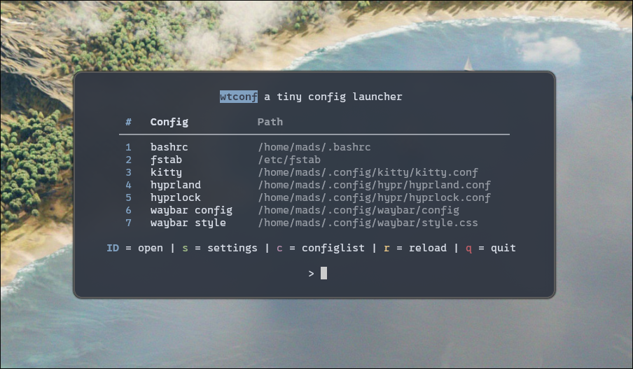

# wtconf - a tiny config launcher written in python



A simple CLI tool to bookmark and launch your config files with your favorite editor.
No black-box shenanigans, no version management – just open your configs fast.


## Installation
Using pipx (recommended):
```
pipx install git+https://github.com/slartibartmads/wtconf.git
pipx ensurepath   # ensure pipx’s bin dir is on your PATH
```

### Dependencies

- [PyYAML](https://pyyaml.org/) - for reading/writing configs
- [Rich](https://github.com/Textualize/rich) - for pretty tables and colors
  
These will be installed automatically if you install via pipx or pip.

## Usage

Add configs to the list:
```
wtconf --add path/to/config.file
```

Entries are stored in:
```
~/.config/wtconf/configlist.yaml
```
This config can also be launched from the app to edit labels or delete entries.

## Uninstall
```
pipx uninstall wtconf
rm -rf ~/.config/wtconf # deletes wtconf config files
```
